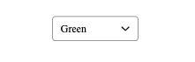
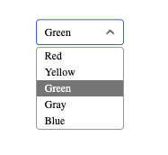
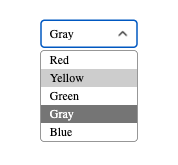
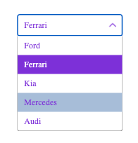

<h1 align="center">Select (React, Typescript)</h1>

---
<h2 align="center">Available Scripts</h2>

npm run dev

npm run build

npm run lint

npm run preview

---

<h2 align="center">
UI-Kit Select
</h2>

Keyboard and mouse controls are supported.

---

